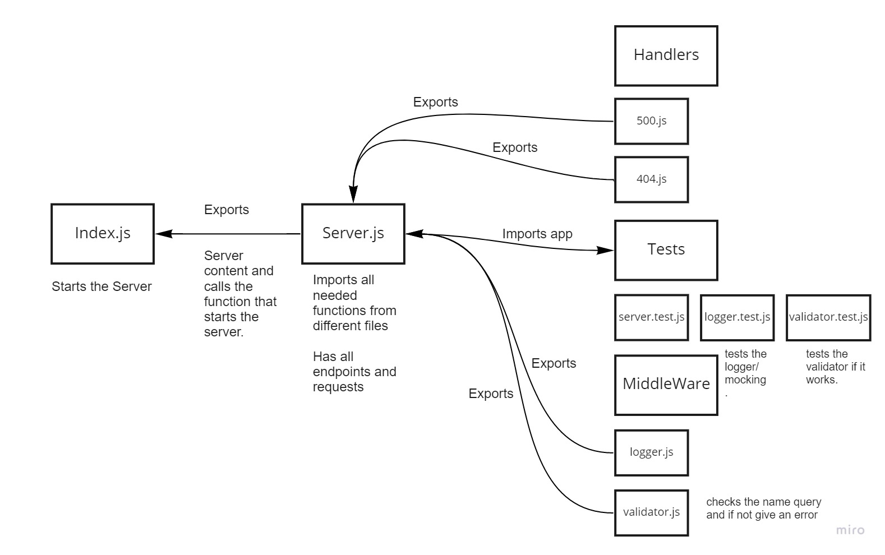

# basic-express-server

## LAB - 02
### Deployment Test with Validator and Logger
Author: Sana Ishaqat

[tests report (actions)](https://github.com/SanaIshaqat/basic-express-server/actions)

[back-end (heroku proof of life)](https://sana-basic-express-server-02.herokuapp.com/alive)

[back-end (heroku /person and name query )](https://sana-basic-express-server-02.herokuapp.com/person?name=sana)

[PR Link](https://github.com/SanaIshaqat/basic-express-server/pull/2)

*most work was done directly on the main by accident*

### Setup
.env requirements
PORT - Port Number

### Running the app
npm run dev
Endpoint: /status
Returns Object
{
  "status": "running",
  "port": 3030,
  "domain": "sanaishaqat-server-deploy-prod.herokuapp.com"
}

### Tests
Unit Tests: npm run test
Run Server: npm run dev "Runs Index.js"

UML
